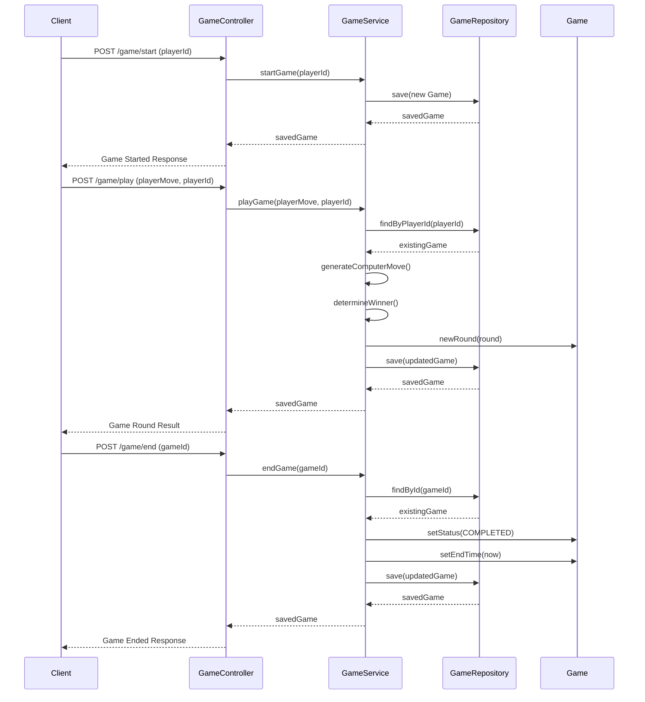

# Rock Paper Scissors Game API

This API provides a server-side implementation of Rock Paper Scissors. It features player management, game logic with a strategy to counter human non-random choices, and game statistics. Designed for scalability, it offers endpoints for creating full-featured Rock Paper Scissors games across various platforms.
  


## How to run it
Prerequisites:
- Java 17 or higher
- Maven 3.6 or higher
- MongoDB 4.4 or higher

Steps:
### 1. Clone the repository
```bash
   git clone [https://github.com/kennedykjj/rock-paper-scissors-api.git](https://github.com/kennedykjj/paper-rock-scisso)
```
### 2. build the project
```bash
   mvn clean install
```
### 3. Run the application
```bash
   java -jar target/rock-paper-scissors-api-1.0.0.jar
```
### 4. The API will be available at http:localhost:8080

## Features

### 1. Player Registration

Register a new player in the system.

**cURL Example:**
```bash
curl -X POST "http://localhost:8080/players/register?username=player1&password=secret&email=player1@example.com"
```
Success Response:
```bash

HTTP Status: 201 Created
Player registered successfully.
```
Error Response:
```bash

HTTP Status: 400 Bad Request
Username already exists.
```

### 2. Start Game

Start a new game for a player.

**cURL Example:**
```bash
curl -X POST "http://localhost:8080/game/start?playerId=player1"
```
Success Response:
```bash

HTTP Status: 201 Created
{
  "id": "game123",
  "playerId": "player1",
  "status": "IN_PROGRESS",
  "rounds": [],
  "startTime": "2023-04-20T10:00:00",
  "endTime": null
}
```
Error Response:
```bash

HTTP Status: 404 Bad Request
```

### 3. Play Game

Make a move in an ongoing game.

**cURL Example:**
```bash
curl -X POST "http://localhost:8080/game/play?playerMove=ROCK&playerId=player1"
```
Success Response:
```bash

HTTP Status: 200 OK
{
  "id": "game123",
  "playerId": "player1",
  "status": "IN_PROGRESS",
  "rounds": [
    {
      "playerMove": "ROCK",
      "computerMove": "SCISSORS",
      "result": "PLAYER_WINS",
      "date": "2023-04-20T10:05:00"
    }
  ],
  "startTime": "2023-04-20T10:00:00",
  "endTime": null
}
```
Error Response:
```bash

HTTP Status: 404 Not Found
Game not found for the player

HTTP Status: 400 Bad Request
Invalid move. Allowed moves are ROCK, PAPER, SCISSORS.
```

### 4. End Game

End an ongoing game.

**cURL Example:**
```bash
curl -X POST "http://localhost:8080/game/end?gameId=game123"
```
Success Response:
```bash

HTTP Status: 200 OK
{
  "id": "game123",
  "playerId": "player1",
  "status": "FINISHED",
  "rounds": [...],
  "startTime": "2023-04-20T10:00:00",
  "endTime": "2023-04-20T10:10:00"
}
```
Error Response:
```bash

HTTP Status: 404 Not Found
Game not found.

HTTP Status: 400 Bad Request
Game is already completed.
```

### 5. View Game History

Retrieve the game history for a player.

**cURL Example:**
```bash
curl "http://localhost:8080/game/history?playerId=player1"
```

Success Response:
```bash

HTTP Status: 200 OK
[
  {
    "id": "game123",
    "playerId": "player1",
    "status": "COMPLETED",
    "rounds": [...],
    "startTime": "2023-04-20T10:00:00",
    "endTime": "2023-04-20T10:10:00"
  },
  {
    "id": "game124",
    "playerId": "player1",
    "status": "IN_PROGRESS",
    "rounds": [...],
    "startTime": "2023-04-20T11:00:00",
    "endTime": null
  }
]
```
Error Response:
```bash

HTTP Status: 404 Not Found
Player not found.
```
